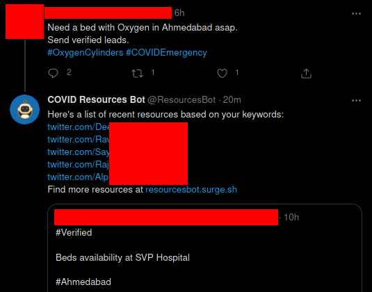
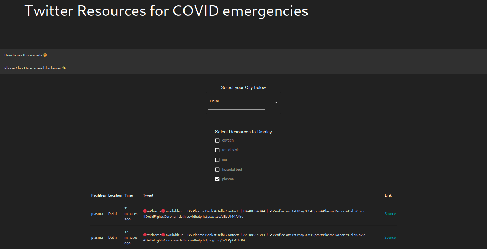

# Twitter Bot for Resources during the COVID emergencies 

### About

We have created a Twitter bot([@ResourcesBot](https://twitter.com/ResourcesBot) and [@ResourcesBot1](https://twitter.com/ResourcesBot1)) that searches for **verified** medical resources such as oxygen, remdesivir, ICU, hospital beds and it then searches for people who are asking for **leads** the above mentioned resources and replies them with the resources they asked for.

### How it works

The bot searches for resources on Twitter using a search query like:
`<city_name> <resource_name> verified -needed -required -leads -requirement -need -please -filter:retweets`. 

And then the bot searches for people asking for resources using a search query like:
`<city_name> <resource_name> required OR leads OR need -filter:retweets`

Currently monitored resources: `Oxygen, Remdesiver, ICU beds, Hospital beds, Plasma Donors, Ventilators`

### Bot in action:

### Website

Twitter bot has it's limitations. To tackle those we have created a website. Go visit it at https://resourcesbot.surge.sh
 

### How to help

You can always contribute to the project. Learn how to contribute here: https://opensource.guide/how-to-contribute/

For those who do not know how to code, you can still contribute by spreading the word about the bot. And by asking people:
- who are sharing medical, you can ask them to share in this format `<city_name> <resource_available> verified`
- who are asking for leads, you can ask them to ask for leads in this format `<city_name> <resource_needed> leads required`

### Contributors

Scrapping for resources and automated reply:
- Harshit Maheshwari ([@fake_batman_](https://twitter.com/fake_batman_))

Website:
- Abhinav Srivastav ([@AbhinavMir](https://github.com/AbhinavMir/))
- Sarthak Pranesh ([@SarthakPranesh](https://github.com/sarthakpranesh))

Machine Learning:
- Harsha Bomanna ([@harshablast](https://github.com/harshablast))
- Arunkumar L ([@CleanPegasus](https://github.com/CleanPegasus/))

### Find (other) resources:

Don't singularly rely on this tool, there are some amazing threads you can refer to. Here are few: 
- https://external.sprinklr.com/insights/explorer/dashboard/601b9e214c7a6b689d76f493/tab/5?id=DASHBOARD_601b9e214c7a6b689d76f493
- For plasma donation: http://friends2support.org
- Twitter search for COVID: https://covid19-twitter.in/
